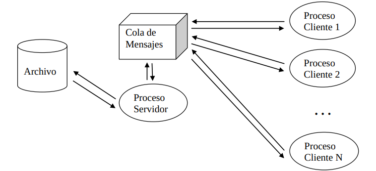

# TP II – Unidad V a VII – OBLIGATORIO


1) Realizar un chat entre procesos independientes usando __fifo’s__. Cada proceso independiente recibe
por línea de comandos 2 parámetros: el nombre del fifo de escritura y el nombre del fifo de lectura.
Puede resolver todo el problema programando un único programa **(chatfifo.c)** y creando dos
procesos a partir de un mismo programa, ejecutándolo desde dos terminales distintas con distintos
argumentos. Establezca un protocolo para salir del chat, por ejemplo, cuando se tipea la palabra
**“bye”** el proceso deja de enviar y recibir mensajes a través de los fifo’s.


Utilice línea de comandos para crear los fifo’s, ejemplo:

```bash
mkfifo fifo1
```
```bash
mkfifo fifo2
```

Abrir dos terminales y ejecutar:

```bash 
 ./chatfifo fifo1 fifo2
```

```bash
 ./chatfifo fifo2 fifo1
```

Luego puede destruir los fifos creados:
```bash
 unlink fifo1
 unlink fifo2
```

---

2. Desarrolle un programa de chat usando Cola de Mensajes. Repita el mismo esquema de procesos
que en el punto anterior (2 procesos independientes con un hijo cada uno). Puede resolverse con una
única cola de mensajes en donde se escriben mensajes de distinto tipo (al menos requerirá mensajes
de 2 tipos distintos). Puede resolverlo con un único programa, del cual crea dos procesos
independientes y recibe argumentos por línea de comandos.

---

3. Desarrolle un programa de chat usando Memoria Compartida. Repita el mismo esquema de
procesos que en el punto anterior (2 procesos independientes con un hijo cada uno). Puede
resolverse con una única área de memoria con espacio para dos mensajes (digamos, de 256 bytes
cada una, ésta será la limitación del programa, no acepta mensajes de más de 256 caracteres). Se
requerirá de dos semáforos para que, cuando un proceso escriba un mensaje no permita que otro
proceso lo lea hasta que la escritura no se haya completado y cuando un proceso lea, impedir que
otro proceso escriba el mensaje que se está leyendo.

---

4. Desarrolle un programa de chat usando archivos. Elija las estructuras de datos y organización de
archivos que mejor se adapte a la resolución de este problema. Realice el diseño de la aplicación y
luego su implementación.

---

5. Se pretende compartir un archivo de acceso directo entre múltiples procesos utilizando una cola
de mensajes como medio de comunicación bidireccional entre un proceso server y múltiples
procesos clientes. El esquema es el siguiente:



El protocolo entre los procesos clientes (todos iguales) y el proceso servidor es el siguiente:
-Todos los procesos cliente utilizan la misma cola de mensajes (0xA)
-Para simplificar, el formato del registro del archivo de acceso directo es el siguiente:

> Estado,1 byte (0 es registro libre, 1 registro ocupado, 2 registro borrado) Descripción,100 bytes, cadena de caracteres q incluye \0 al final de la cadena

Y esta creado, inicializado con 1000 registros con estado 0 y descripción con ceros binarios.
-Los procesos clientes son todos iguales e interactivos, con opción de menú para agregar registros,
modificar registros, borrar registros, leer o consultar registros y salir.
-Todos los procesos clientes envían mensajes de tipo 1 a la cola 0xA en este formato:

```html  
<pid>,<número de registro>,<descripción, char[100]>
```

Dónde:
\<pid> es un número entero que representa el id de proceso
<número de registro> es el número de registro objetivo dentro del archivo, numero entero entre 0 y
N- del archivo”
<descripción> cadena de caracteres de máximo 100 bytes (incluyendo \0) que representa el
contenido de campo Descripción del archivo de acceso directo. Cuando Descripción es “borrar”
significa que se pretende borrar ese registro y <numero de registro> debe estar entre 0 y N-1.
Cuando Descripción es “leer” significa que se pretende leer ese registro y <numero de registro>
debe estar entre 0 y N-1.
Ejemplo para proceso cliente con pid=1234:

```html
1234,-1,hola
1234,45,q tal
1234,54,borrar
1234,45,leer
```

El último ejemplo significa “leer el registro 45", el anterior “borrar el registro 54”.
-El proceso servidor siempre va a responder al proceso cliente utilizando la misma cola de mensajes
(0xA)

+ Si el proceso servidor no responde a un proceso cliente, éste quedará bloqueado.
+ Si el proceso servidor recibe CTRL+C (señal de interrupción), significa que debe terminar de
atender al cliente actual (si es que alguno se está atendiendo en este momento) y finalizar su trabajo.
+ El proceso servidor recibe por línea de comandos el nombre del archivo de acceso directo, si el
archivo existe, lo abre de R/W, si no existe, lo crea e inicializa y lo deja abierto de R/W listo para
trabajar.
+ El tipo de mensaje que grabará en la cola el proceso servidor, como respuesta a una petición de
proceso cliente será de tipo \<pid> (es decir, coincide con el pid del proceso cliente que luego lo
leerá)
+ El formato de respuesta del proceso servidor en la cola es el mismo (en cuanto a tipos de datos y
longitud) que el enviado por el cliente:

```html 
<retorno>,<numero registro>,<descripción>
```

Dónde:
\<retorno> es un número entero, 0 significa error y el campo descripción contiene la descripción del
error; 1 significa que no hubo error y el campo descripción contiene el campo descripción del
registro.

\<numero registro> es un número entero que indica el registro del archivo de acceso directo afectado
por la operación que el proceso cliente envió
\<descripción> cadena de 100 bytes máximo (incluye \0) que contiene la el campo descripción del
registro insertado, borrado, modificado, leído. En caso de que <retorno> sea 0, contiene una
descripción de error.
Ejemplo de respuestas de proceso servidor para peticiones de proceso cliente con pid=1234:

```html
1,1000,hola
1,45,q tal
0,54,registro 54 esta vacio
1,45,q tal
```

En este ejemplo se asume que el archivo de acceso directo fue creado con 1000 registros vacíos (de
0 a 999), por lo tanto, si se pide agregar un registro, éste será el registro 1000. No se puede borrar
un registro que está vacío, como es el caso del registro 54.
Esta versión de este programa no contempla los problemas de acceso concurrente a registros o
manejo “transaccional” de registros.

---

6. Modifique los programas servidor y cliente del punto anterior para trabajar de una forma
“transaccional” con los registros. Puede suceder que uno o más procesos clientes podrían ejecutarse
desde distintas terminales remotas conectadas a un mismo computador, por lo tanto, podría tratarse
de distintos usuarios que están modificando “al mismo tiempo” registros de este archivo de acceso
directo. Entonces, para evitar que un usuario interfiera con otro ante la modificación “concurrente”
de un registro1
, un usuario podría utilizar un mecanismo de lock/unlock de registro para asegurarse
que otro usuario no pueda usar un registro determinado cuando él lo tome como propio. Se supone
que el lock dura poco tiempo, un usuario hace lock del registro X, luego puede leerlo, modificarlo,
etc y por último tiene que hacer un unlock para permitir que otros usuarios usen dicho registro. Un
registro con lock puesto, solo puede ser usado por ese usuario/proceso cliente únicamente. El
registro se libera haciendo un unlock. Si se pretende hacer un cambio sobre un registro sin hacer
lock previamente, solo se permitirá en caso de que el registro no este previamente con lock.

+ Se mantiene el formato de mensajes entre proceso servidor y procesos clientes.
+ Ahora un proceso cliente puede enviar mensaje de lock, ejemplo de lock sobre registro 45 enviado
por proceso cliente 1234:

```bash
1234,45,lock
```

Y también puede enviar mensaje de unlock:

```bash
1234,45,unlock
```

+ El proceso servidor responderá –cuando no hay error- ante el mensaje de lock de la siguiente forma
(asumiendo que el contenido del registro es “q tal”):

```bash
1,45,q tal
```

Y ante un mensaje de unlock:

```bash
1,45,q tal
```

En caso de error, podrá enviar el mensaje correspondiente:

```bash
0,45,registro ya lockeado por pid 4567
0,45,registro 45 nunca tuvo lock previo
```

De esta forma, el cambio del registro 45 por parte del proceso cliente 1234, sería:

```bash
1234,45,lock
1234,45,nueva descripción
1234,45,unlock
```

Esta técnica es especialmente útil cuando “la transacción” de un proceso cliente es modificar un
grupo de registros, de forma tal, de lograr la modificación de TODOS los registros o bien ninguno
de ellos, ejemplo (el proceso cliente 1234 pretende modificar 3 registros):

```bash
1234,45,lock
1234,54,lock
1234,75,lock
1234,45,nueva descripción
1234,54,otra descripción
1234,75,otra descripción
1234,75,unlock
1234,54,unlock
1234,45,unlock
```

Si el proceso 1234 logra obtener satisfactoriamente todos los lock’s entonces puede proceder a la
modificación, caso contrario, deberá hacer los unlocks de aquellos locks que logró obtener y volver
a intentar la transacción nuevamente.
Discuta con los miembros de su equipo o en clase, la forma de implementación de este nuevo
protocolo.

--- 

7. Volviendo al ejercicio 8 del “TP I – Unidad I a IV – OBLIGATORIO”, ahora pretendemos
implementar la misma funcionalidad pero utilizando ./wserver/server2 , creando una aplicación web
(que se compilará como una librería shared .so, al estilo de app1, app2, app3 que vienen como
ejemplo junto con ./wserver/server2) que responda a peticiones http de comandos Linux a ejecutar y
devolviendo el resultado de la salida de dichos comandos, de forma tal, que desde index.html se
utilicen llamadas AJAX (usando librería jquery, por ejemplo) y se obtenga el resultado sin
necesidad de recargar la página o que el navegador web “salte” a otra página web (como sucede en
TP I); sino que el resultado se muestre dentro de un tag html \<div> \</div> en la misma página
index.html. Observe el código de index.html que viene como ejemplo (que contiene ejemplos de
llamadas AJAX usando la librería jquery), el código de las aplicaciones web, los scripts de
compilación de las aplicaciones web y el archivo de configuración de ./wserver/server2
(server2.conf). Resumiendo, se pretende reemplazar el proceso CGI por una aplicación web AJAX
que permita transformar a index.html en una aplicación SPA (single page application). No puede
usar la función popen() de la forma que esta hecho en app3, deberá hacer fork(), exec() y
conectar pipes de la forma adecuada para leer la salida del comando, reusar código del TP I.

| Fuente | Link  |
| ------ | ----- |
| grch   | [Tp original](https://grch.com.ar/docs/so/trabajos.practicos/obligatorios/Unidad_V_VIItp2.pdf) |
